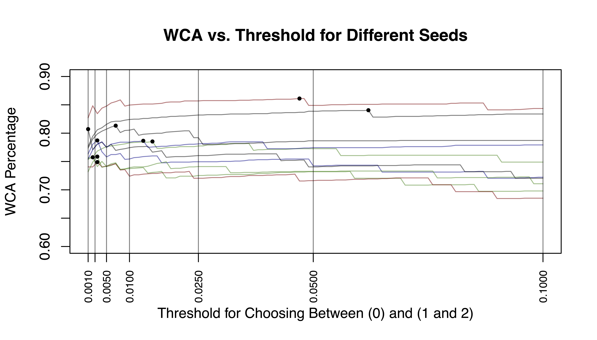

```{r setup, include=FALSE}
library(tidyverse)
library(knitr)
# setwd("/Users/andyshen/Desktop/Git/Stats-101C-F20/Midterm Project")
knitr::opts_chunk$set(echo = FALSE, fig.align = "center")
train <- read.csv("training.csv")
tbl <- 0
fig <- 0
```

## Introduction and Setup

The purpose of this analysis is to identify certain genes that play a role in cancer. We apply statistical learning techniques to a data set of genes and a large number of mutation-related, genomic, phenotype, and epigenetic features; with the goal of identifying oncogenes (OGs), tumor suppressor genes (TSGs), and neutral genes (NGs), ultimately aiding future research into cancer prevention, diagnosis, and treatment.

After plotting each predictor against its respective gene class, we noticed that there existed outliers for many predictor variables in the data set. Most plots saw clusters of points in certain locations without much variability, but there was always at least one stray point in many of the plots that stood out and did not fit the general trend of the plot. We decided to remove the top 50 observations containing the greatest number of extremes (which we defined as data points that were either three standard deviations above or below the mean, which was intended to be more extreme than the typical `1.5 * IQR` standard for outliers), as well as extreme points that clearly stood out as unusual when examining the scatterplots for each predictor. We also remove all rows with more than half of the predictors recorded as 0 in case these metrics might correspond to genes that are irrelevant to the predictions of this analysis. This will hopefully reduce variability and allow predictions to be more accurate. 

Because there were no unknown (`NA`) values in the data set, we did not remove any observations on the basis of missing values. While a vast majority of the predictors were statistically significant, we still had a large number of predictors since the data set had over 90. To further refine our predictors to the most important ones, we visualized the correlation amongst our subset of predictors to see which variables exhibited high correlation. After refining our predictors to those that were both highly significant and largely uncorrelated were we able to begin fitting our models.

## Evaluation Metrics

In terms of evaluating our model, we selected a model using the Linear Discriminant Analysis (LDA) method as well as with Logistic Regression. We prefer this method due to its relatively low flexibility compared to its quadratic counterpart, as well as its reasonable, but not exorbitantly high, test prediction rate. For all techniques used, we ran our model numerous times with different seeds and submitted the model which had a weighted categorization accuracy that was around the average WCA score (neither the maximum nor the minimum across various seeds), in order to avoid submitting an inaccurate or over-fitted model. 

We calculated the performance of our model using the weighted categorization accuracy (WCA). This score places extra emphasis on correctly identifying oncogenes and tumor suppressor genes  (20 points), genes that play the largest role in detecting cancer. Less weight is placed on the neutral genes (1 point), since their relevance in cancer research was not high.

The distribution of the response variable in the training set is shown in Table `r tbl <- tbl + 1; tbl`.

```{r}
class_dist_train <- data.frame(
  "NG" = paste0(round(mean(train$class == 0) * 100, 2),"%"),
  "OG" = paste0(round(mean(train$class == 1) * 100, 2),"%"),
  "TSG" = paste0(round(mean(train$class == 2) * 100, 2),"%")
)
caption <- paste("Percentage of Gene Type in Training Set.")
class_dist_train %>% kable(digits = 3, caption = caption)
```

This table shows us that, immediately, we had to consider the compounding effects of both a weighted categorization accuracy score (as opposed to a standard test accuracy score) as well an unevenly distributed response variable, with the neutral genes (`NG`, class `0`) having drastically more observations than the other two classes (`OG`, class `1` and `TSG`, class `2`).

After testing various thresholds, predictor combinations, and training/test data sets, LDA proved to be the most consistent when it came to the weighted test error rate. Other techniques, such as Quadratic Discriminant Analysis (QDA) and K-Nearest Neighbors (KNN), saw test error rates that fluctuated when the training and test data were changed. We use 5-fold cross-validation to validate each of our models. Moreover, the sporadically low test error rates seen in QDA and KNN indicate overfitting of the data, while the sporadically high test error rates indicate a poor model fit. Both the consistency of the the LDA technique and the inconsistency of the more flexible techniques led us to conclude that the relationship of the data is likely a linear one (or at least not very nonlinear). 

### Candidate Models

The predictors for our first candidate model (`Model 13`) were selected by examining a correlation heat map and fitting a logistic regression model with all predictors. Based on the predictors that were largely uncorrelated from the heat map, we examine all of the significant predictors from the logistic regression model and extract the top 28 predictors that were both significant in distinguishing between each of the three response classes *and* had low correlations with other predictors. For instance, many of the predictors beginning with `Broad_` were statistically significant, but were very closely correlated with other predictors of the same `Broad_` family. This led us to only select the most significant predictors from this family that had the least correlation with other predictors of the data set. The heat map is shown below in Figure 1.

```{r,out.width="80%"}
knitr::include_graphics("correlation_heatmap.jpg")
```


There were many predictors in this data set that were of the same family and closely correlated as well, so we repeated this methodology for all of the significant predictors of the same family. In this analysis, our significance level $\alpha$ was 0.05 divided by the number of predictors in the data set. We scale $\alpha$ because we want to decrease the likelihood of a false positive that could result from running the model multiple times across many different seeds.

To select a model, we calculated the weighted categorization accuracy using 5-fold cross-validation across randomly set seeds and selected the model with the WCA that was neither the maxiumum nor minimum to account for possible overfitting. The thresholds with the most consistent performance across all seeds seems to occur at 0.01 or less. 

Our weighted categorization accuracy calculations during 5-fold cross-validation revealed that our candidate model performed most accurately and consistently with a threshold of approximately 0.005 to 0.01 as seen in Figure 2. The threshold is regarding the probabilities for classes 1 and 2 (`OG` and `TSG`). If either of these classes exceeds the threshold, we take the higher probability of the two; if neither exceeds it, we choose class 0 (`NG`). Our primary candidate model's WCA for our training validation data was `r round(0.8100, 3)`, which resulted in a WCA of `r round(0.85248, 3)` on the public leaderboard for Kaggle. 

Predictor selection for our second candidate model was done similarly to our first model: we utilized the same predictors in this model as the first candidate. The key difference between the two models was the chosen threshold of 0.01 (vs. 0.05 for the first model). As such, our second model was also less likely to choose genes of classes 1 and 2 unless the probabilities were greater than 1%, as opposed to 0.5% in candidate model 1. Our second candidate model's WCA for the training validation data was `r round(0.8241358, 3)`, which resulted in a WCA of `r round(0.81130, 3)` on the public leaderboard for Kaggle.   

We selected the 0.005 threshold as our primary candidate model because as shown in Figure 2 (which shows how the WCA varies with increasing threshold for both candidate LDA models), many of the best threshold were below 0.005. However, we  included a threshold of 0.01 as a secondary candidate model since there were a few seeds for which a higher threshold performed better and we want to account for that possibility.

```{r, out.width='65%'}

```


The reasoning for selecting LDA for our two model selections is due to LDA's limited flexibility, which has less variability and provides more consistent WCA scores across various subsets of training and test data. Nonetheless, we believe our LDA model's threshold provides enough flexibility to account for its strong performance: by lowering our threshold to a value no higher than 1%, we account for the uneven distribution and scoring of different responses by  placing greater emphasis on the less likely responses (OGs and TSGs) because they are weighted more heavily. This allows us to predict the less-frequent responses at more appropriate intervals, ultimately aiding our WCA score. Overall, we believe that our model balances the bias-variance tradeoff adequately and, when combined with the preprocessing we did on the data (both with respect to predictors as well as outlier/extreme observations), enables us to get a better predictability for future observations (i.e. test data), which we can see in our Kaggle score and WCA performance.

---

\newpage

### Statement of Contribution

Andy Shen was in charge of team organization and logistics. Andy was also the primary author of the final report. Andy also aided in the model fitting process by providing advice, double-checking work, and submitting his own predictions.

Ethan Allavarpu was in charge of fitting the model and trying out different techniques. Andy and Varan would assist Ethan as needed and fit their own models as well. Ethan ensured every model submitted was valid and correct. Ethan assisted in fine-tuning the final report by ensuring that the correct models were depicted with the right measurements.

Varan Nimar provided assistance with both model fitting and report writing. Varan would provide feedback on different models to fit and he proposed different techniques to try. Varan assisted Andy in writing and editing specific sections of the report.

\pagebreak

### Appendix for R Code


```{r, eval = FALSE, echo = TRUE}
# Step 1: Look at variables and models holistically, see what stands out
## Predictors: Look for correlation, outliers
## Classification: See best WCA performers, low variance across seeds

training <- read.csv("training.csv", stringsAsFactors = TRUE)
sort(abs(cor(training)["class", ]), decreasing = TRUE)[2:19]
training$class <- factor(training$class)
levels(training$class) <- c("NG", "OG", "TSG")
dim(training)
names(training)[c(1, 99)]
barplot(table(training$class))
table(training$class) / nrow(training)
any(is.na(training))
library(ggplot2)
scatter <- function(var) {
  ggplot(training, aes_string(var, 1)) +
    geom_jitter(width = 0.05, height = 0.1, size = 0.1,
                colour = rgb(0, 0, 0, alpha = 1 / 3))
}
scat_plot <- lapply(names(training)[-99], scatter)
library(gridExtra)
grid.arrange(grobs = scat_plot[1:20], ncol = 4)
grid.arrange(grobs = scat_plot[21:40], ncol = 4)
grid.arrange(grobs = scat_plot[41:60], ncol = 4)
grid.arrange(grobs = scat_plot[61:80], ncol = 4)
grid.arrange(grobs = scat_plot[81:98], ncol = 4)
library(ggplot2)
scatter <- function(var) {
  ggplot(training, aes_string(var, "class")) +
    geom_jitter(width = 0.05, height = 0.1, size = 0.1,
                colour = rgb(0, 0, 0, alpha = 1 / 3))
}
scat_plot <- lapply(names(training)[-99], scatter)
library(gridExtra)
grid.arrange(grobs = scat_plot[1:20], ncol = 4)
grid.arrange(grobs = scat_plot[21:40], ncol = 4)
grid.arrange(grobs = scat_plot[41:60], ncol = 4)
grid.arrange(grobs = scat_plot[61:80], ncol = 4)
grid.arrange(grobs = scat_plot[81:98], ncol = 4)
score <- function (conf_mat) {
  print(sum(diag(conf_mat) * c(1, 20, 20)))
  print(sum(diag(conf_mat) * c(1, 20, 20)) / sum(apply(conf_mat, 2, sum) * c(1, 20, 20)))
}

classify <- function(probs) {
  if (any(probs[2:3] > 0.05)) {
    subset <- probs[2:3]
    output <- which(subset == max(subset))
    if (length(output) > 1) {
      output <- sample(1:2, 1)
    }
  } else {
    output <- 0
  }
  output
}
library(dplyr)
vars <- training %>% select(Broad_H3K9ac_percentage, N_LOF, pLOF_Zscore,
                            N_Splice, LOF_TO_Total_Ratio, VEST_score, BioGRID_log_degree,
                            Broad_H3K79me2_percentage, RVIS_percentile,
                            Polyphen2, Broad_H3K36me3_percentage, class)
vars$class <- factor(vars$class)
levels(vars$class) <- c("NG", "OG", "TSG")

# Visual display of correlation matrix for predictors
cor_mtx <- round(cor(vars[, names(vars) != "class"]), 2)
library(reshape2)
melted_cor_mtx <- melt(cor_mtx)
cor_heatmap <- ggplot(data = melted_cor_mtx, aes(x = Var1, y = Var2, fill = value)) +
  geom_tile()
cor_heatmap <- cor_heatmap +
  scale_fill_gradient2(low = "blue", high = "red", mid = "white",
                       midpoint = 0, limit = c(-1, 1), space = "Lab",
                       name="Correlation") + 
  theme_minimal() +
  theme(axis.text.x = element_text(angle = 45, vjust = 1, size = 12, hjust = 1))
cor_heatmap

# Run various fitted models to see which perform best with respect to variability and WCA
scores_mat <- matrix(nrow = 10, ncol = 4)
k <- 1
set.seed(1223)
for (i in runif(10, min = 1, max = 10^7)) {
  set.seed(i)
  vars <- training %>% select(Broad_H3K9ac_percentage, N_LOF, pLOF_Zscore,
                              N_Splice, LOF_TO_Total_Ratio, VEST_score, BioGRID_log_degree,
                              Broad_H3K79me2_percentage, RVIS_percentile,
                              Polyphen2, Broad_H3K36me3_percentage, class)
  library(caret)
  vars_test <- createDataPartition(vars$class, p = 0.7, 
                                   list = FALSE)
  vars_train <- vars[vars_test, ]
  vars_test <- vars[-vars_test, ]
  
  train_cont <- trainControl(method = "cv", number = 5,
                             classProbs = TRUE, savePredictions = TRUE)
  
  knn_ft <- train(class ~ ., data = vars_train, method = "knn",
                  preProc = c("center", "scale"),
                  trControl = train_cont, tuneGrid = expand.grid(k = 5))
  preds <- predict(knn_ft, newdata = vars_test, type = "prob")
  knn_mod <- table("pred"=unlist(apply(preds, 1, classify)), "obs" = vars_test$class)
  scores_mat[k, 1] <- score(knn_mod)
  train_cont <- trainControl(method = "cv", number = 5,
                             classProbs = TRUE, savePredictions = TRUE)
  qda_ft <- train(class ~ ., data = vars_train, method = "qda",
                  preProc = c("center", "scale"), trControl = train_cont)
  preds <- predict(qda_ft, newdata = vars_test, type = "prob")
  
  qda_mod <- table("pred"=apply(preds, 1, classify), "obs" = vars_test$class)
  scores_mat[k, 2] <- score(qda_mod)
  train_cont <- trainControl(method = "cv", number = 5,
                             classProbs = TRUE, savePredictions = TRUE)
  lda_ft <- train(class ~ ., data = vars_train, method = "lda",
                  preProc = c("center", "scale"), trControl = train_cont)
  preds <- predict(lda_ft, newdata = vars_test, type = "prob")
  
  lda_mod <- table("pred"=apply(preds, 1, classify), "obs" = vars_test$class)
  scores_mat[k, 3] <- score(lda_mod)
  mn <- nnet::multinom(class ~ ., data = vars_train, model = TRUE)
  preds <- predict(mn, newdata = vars_test, type = "prob")
  predclass <- apply(preds, 1, classify)
  mn_mod <- table("pred"=predclass, "obs"=vars_test$class)
  scores_mat[k, 4] <- score(mn_mod)
  k <- k + 1
}
colnames(scores_mat) <- c("KNN", "QDA", "LDA", "Logistic")
data.frame(scores_mat)
# LDA performs better and is generally less variable than the other models
apply(scores_mat, 2, mean)
apply(scores_mat, 2, sd)

## Step 2: Consider removing observations and correlated predictors
# Create an outlier function
outlier <- function(data) {
  low <- mean(data) - 3 * sd(data)
  high <- mean(data) + 3 * sd(data)
  which(data < low | data > high)
}
library(ggplot2)
scatter <- function(var) {
  ggplot(training, aes_string(var, "class")) +
    geom_jitter(width = 0.05, height = 0.1, size = 0.1,
                colour = rgb(0, 0, 0, alpha = 1 / 3))
}
scat_plot <- lapply(names(training)[-99], scatter)
library(gridExtra)
grid.arrange(grobs = scat_plot[1:20], ncol = 4)
grid.arrange(grobs = scat_plot[21:40], ncol = 4)
grid.arrange(grobs = scat_plot[41:60], ncol = 4)
grid.arrange(grobs = scat_plot[61:80], ncol = 4)
grid.arrange(grobs = scat_plot[81:98], ncol = 4)
outliers <- table(unlist(lapply(training[,-99], outlier)))
outlier_index <- sort(outliers, decreasing = TRUE)
# Remove 50 most common outlier observations (i.e. outliers across multiple predictors)
training <- training[-as.numeric(names(outlier_index)[1:50]),]

# The below variables had outstanding outliers which we chose to remove
sort(training$Missense_TO_Silent_Ratio, decreasing = TRUE)[1:10]
training <- training[-which(training$Missense_TO_Silent_Ratio > 100), ]
sort(training$Missense_KB_Ratio, decreasing = TRUE)[1:10]
training <- training[-which(training$Missense_KB_Ratio > 2000), ]
sort(training$LOF_TO_Silent_Ratio, decreasing = TRUE)[1:10]
training <- training[-which(training$LOF_TO_Silent_Ratio > 5), ]
sort(training$Gene_expression_Z_score, decreasing = TRUE)[1:10]
training <- training[-which(training$Gene_expression_Z_score > 4), ]
sort(training$dN_to_dS_ratio, decreasing = TRUE)[1:10]
training <- training[-which(training$dN_to_dS_ratio > 5),]
sort(training$Silent_KB_Ratio, decreasing = TRUE)[1:10]
training <- training[-which(training$Silent_KB_Ratio > 200), ]
sort(training$Lost_start_and_stop_fraction, decreasing = TRUE)[1:10]
training <- training[-which(training$Lost_start_and_stop_fraction > 0.2),]
sort(training$Synonymous_Zscore, decreasing = FALSE)[1:10]
training <- training[-which(training$Synonymous_Zscore < -15), ]
numeric_training <- training[,-99]

## Lots of zeroes for some observations, so removed those observations
## with quite a few zeroes across predictor variables
n_zeroes <- rep(NA, nrow(numeric_training))

for(i in seq_len(nrow(numeric_training))){
  row_i_zeroes <- 0
  for(j in seq_len(ncol(numeric_training))){
    if(round(numeric_training[i,j], digits = 5) == 0){
      row_i_zeroes <- row_i_zeroes + 1
    }
  }
  n_zeroes[i] <- row_i_zeroes
}
## Remove observations with more than half of their predictor variable values as zero
## (possibly "junk" observations/irrelevant)
training <- training[n_zeroes <= ncol(training) / 2, ]

# Replot predictors vs. class to see if outliers properly removed
library(ggplot2)
scatter <- function(var) {
  ggplot(training, aes_string(var, "class")) +
    geom_jitter(width = 0.05, height = 0.1, size = 0.1,
                colour = rgb(0, 0, 0, alpha = 1 / 3))
}
scat_plot <- lapply(names(training)[-99], scatter)
library(gridExtra)
grid.arrange(grobs = scat_plot[1:20], ncol = 4)
grid.arrange(grobs = scat_plot[21:40], ncol = 4)
grid.arrange(grobs = scat_plot[41:60], ncol = 4)
grid.arrange(grobs = scat_plot[61:80], ncol = 4)
grid.arrange(grobs = scat_plot[81:98], ncol = 4)

# Look at correlation matrices for correlated variables
library(dplyr)
library(caret)
set.seed(12)
vars <- training
cor_mtx <- round(cor(vars[, names(vars) != "class"]), 2)
library(reshape2)
melted_cor_mtx <- melt(cor_mtx)
cor_heatmap <- ggplot(data = melted_cor_mtx, aes(x = Var1, y = Var2, fill = value)) +
  geom_tile()
cor_heatmap <- cor_heatmap +
  scale_fill_gradient2(low = "blue", high = "red", mid = "white",
                       midpoint = 0, limit = c(-1, 1), space = "Lab",
                       name="Correlation") + 
  theme_minimal() +
  theme(axis.text.x = element_text(angle = 45, vjust = 1, size = 12, hjust = 1))
cor_heatmap

which(abs(cor_mtx) > 0.75, arr.ind = TRUE)
# Eliminate all but one of a set of variables highly correlated with one another
correlated <- c("id", "N_LOF", "CDS_length", "LOF_TO_Benign_Ratio",
                "LOF_TO_Total_Ratio", "LOF_TO_Missense_Ratio",
                "Inactivating_mutations_fraction", "Splice_TO_Benign_Ratio",
                "Splice_TO_Total_Ratio", "Missense_TO_Benign_Ratio",
                "NonSilent_TO_Silent_Ratio", "Missense_fraction",
                "One_Minus_S50_score_replication_timing", "CNA_amplification",
                "Gene_expression_Minus_Z_score", "log_gene_length",
                "Minus_Cell_proliferation_rate_CRISPR_KD",
                "Promoter_hypomethylation_in_cancer",
                "Gene_body_hypomethylation_in_cancer",
                "H3K4me2_width", "H3K9ac_width", "H3K9ac_height",
                "Broad_H3K4me1_percentage",
                "Broad_H3K27ac_percentage", "H3K4me1_width",
                "H3K36me3_width", "H3K36me3_height",
                "H3K27me3_width", "H3K27me3_height", "H3K9me3_width",
                "H3K79me2_width", "H3K79me2_height", "H4K20me1_width")
vars <- vars[, !(names(training) %in% correlated)]
cor_mtx <- round(cor(vars[, names(vars) != "class"]), 2)
melted_cor_mtx <- melt(cor_mtx)
cor_heatmap <- ggplot(data = melted_cor_mtx, aes(x = Var1, y = Var2, fill = value)) +
  geom_tile()
cor_heatmap <- cor_heatmap +
  scale_fill_gradient2(low = "blue", high = "red", mid = "white",
                       midpoint = 0, limit = c(-1, 1), space = "Lab",
                       name="Correlation") + 
  theme_minimal() +
  theme(axis.text.x = element_text(angle = 45, vjust = 1, size = 12, hjust = 1))
cor_heatmap


which(abs(cor_mtx) > 0.6, arr.ind = TRUE)
# Eliminate all but one of a set of variables highly correlated with one another
second_correlated <- c("Missense_KB_Ratio", "LOF_KB_Ratio", "Nonsense_fraction",
                       "Frameshift_indel_fraction",
                       "Missense_Damaging_TO_Benign_Ratio",
                       "Missense_TO_Total_Ratio", "Silent_fraction",
                       "BioGRID_clossness", "pLOF_Zscore",
                       "Length_H3K4me3", "Broad_H3K4me3_percentage","H3K4me2_height",
                       "H3K4me3_height", "H3K27ac_width", "H3K27ac_height",
                       "H3K4me1_height", "H3K9me3_height",
                       "Broad_H3K79me2_percentage", "intolerant_pLI",
                       "Broad_H4K20me1_percentage", "Broad_H3K36me3_percentage")

vars <- vars[, !(names(vars) %in% second_correlated)]

cor_mtx <- round(cor(vars[, names(vars) != "class"]), 2)
library(reshape2)
melted_cor_mtx <- melt(cor_mtx)
cor_heatmap <- ggplot(data = melted_cor_mtx, aes(x = Var1, y = Var2, fill = value)) +
  geom_tile()
cor_heatmap <- cor_heatmap +
  scale_fill_gradient2(low = "blue", high = "red", mid = "white",
                       midpoint = 0, limit = c(-1, 1), space = "Lab",
                       name="Correlation") + 
  theme_minimal() +
  theme(axis.text.x = element_text(angle = 45, vjust = 1, size = 12, hjust = 1))
cor_heatmap

# Use logistic regression to see which variables are significant predictors
set.seed(12)
mn <- nnet::multinom(class ~ ., data = vars, model = TRUE)
tidymn <- broom::tidy(mn) %>% arrange(p.value)
tidymn <- tidymn %>% filter(p.value < 0.05 / nrow(tidymn))
terms <- unique(tidymn$term)[-1]
terms

# Double check correlations of final terms

library(dplyr)
cor_mtx <- round(cor(vars[, names(vars) %in% terms]), 2)
library(reshape2)
melted_cor_mtx <- melt(cor_mtx)
cor_heatmap <- ggplot(data = melted_cor_mtx, aes(x = Var1, y = Var2, fill = value, cex.axis = 0.5)) + geom_tile()
cor_heatmap <- cor_heatmap +
  scale_fill_gradient2(low = "blue", high = "red", mid = "white",
                       midpoint = 0, limit = c(-1, 1), space = "Lab", name="Correlation") + 
  theme_minimal() +
  theme(axis.text.x = element_text(angle = 45, vjust = 1, size = 4, hjust = 1)) +
  theme(axis.text.y = element_text(angle = 0, vjust = 1, size = 4, hjust = 1))
cor_heatmap
terms <- terms[terms != "Broad_H3K4me2_percentage"]

cor_mtx <- round(cor(vars[, names(vars) %in% terms]), 2)
library(reshape2)
melted_cor_mtx <- melt(cor_mtx)
cor_heatmap <- ggplot(data = melted_cor_mtx, aes(x = Var1, y = Var2, fill = value, cex.axis = 0.5)) + geom_tile()
cor_heatmap <- cor_heatmap +
  scale_fill_gradient2(low = "blue", high = "red", mid = "white",
                       midpoint = 0, limit = c(-1, 1), space = "Lab", name="Correlation") + 
  theme_minimal() +
  theme(axis.text.x = element_text(angle = 45, vjust = 1, size = 4, hjust = 1)) +
  theme(axis.text.y = element_text(angle = 0, vjust = 1, size = 4, hjust = 1))
cor_heatmap

# Define score (WCA) and classify functions
#function to calculate wca
score <- function (conf_mat) {
  # Diagonal of matrix corresponds to correctly predicted classes
  print(sum(diag(conf_mat) * c(1, 20, 20)))
  print(sum(diag(conf_mat) * c(1, 20, 20)) / sum(apply(conf_mat, 2, sum) * c(1, 20, 20)))
}

# Set new threshold to account for unbalanced data
classify <- function(probs, k) {
  if (any(probs[2:3] > k)) {
    subset <- probs[2:3]
    output <- which(subset == max(subset))
    if (length(output) > 1) {
      output <- sample(1:2, 1)
    }
  } else {
    output <- 0
  }
  output
}

## Step 3: Fit the models
vars <- training %>% select(all_of(terms), class)
set.seed(98764)
thresh_list <- list()
length(thresh_list) <- 10
j <- 1
# for() loop to validate post cross-validation with WCA and varying thresholds
for (rand in ceiling(runif(10, min = 1, max = 10000000))) {
  set.seed(rand)
  vars_split <- createDataPartition(vars$class, p = 0.8, list = FALSE)
  vars_train <- vars[vars_split, ]
  vars_test <- vars[-vars_split, ]
  
  train_cont <- trainControl(method = "cv", number = 5,
                             classProbs = TRUE, savePredictions = TRUE)
  lda_ft <- train(class ~ ., data = vars_train, method = "lda",
                  preProc = c("center", "scale"), trControl = train_cont)
  preds <- predict(lda_ft, newdata = vars_test, type = "prob")
  scores <- numeric(100)
  for (i in seq(from = 0.001, to = 0.1, by = 0.001)) {
    lda_mod <- table("pred"=apply(preds, 1, classify, k = i), "obs" = vars_test$class)
    lda_mod
    scores[i*1000] <- score(lda_mod)
  }
  thresh_list[[j]] <- scores
  j <- j + 1
}

# Plot WCA as a function of threshold for various seeds to see best threshold
thresh_vals <- c(0.001, 0.0025, 0.005, 0.01, 0.025, 0.05, 0.1)
plot(thresh_list[[1]] ~ seq(from = 0.001, to = 0.1, by = 0.001),
     type = "l", ylim = c(0.6, 0.9), col = rgb(0, 0, 0, alpha = 0.5),
     xaxt = "n", ylab = "WCA Percentage",
     main = "WCA vs. Threshold for Different Seeds",
     xlab = "Threshold for Choosing Between (0) and (1 and 2)",
     las = 2)
for (i in 2:10) {
  red <- 0
  green <- 0
  blue <- 0
  if (i %% 4 == 1) {red <- 0.5}
  if (i %% 4 == 2) {green <- 0.5}
  if (i %% 4 == 3) {blue <- 0.5}
  lines(seq(from = 0.001, to = 0.1, by = 0.001), thresh_list[[i]],
        col = rgb(red, green, blue, alpha = 0.5))
  
}
abline(v = thresh_vals, col = rgb(0, 0, 0, alpha = 0.5))
points(unlist(lapply(thresh_list, which.max)) * 0.001, unlist(lapply(thresh_list, max)),
       pch = 19, cex = 0.5)
axis(side = 1, at = thresh_vals, cex.axis = 0.75, las = 2)
best_thresh <- unlist(lapply(thresh_list, which.max))
median(best_thresh * 0.001)
thresh_val_scores <- matrix(nrow = 10, ncol = length(thresh_vals))
colnames(thresh_val_scores) <- thresh_vals
for (i in 1:10) {
  thresh_val_scores[i, ] <- thresh_list[[i]][thresh_vals * 1000]
}
apply(thresh_val_scores, 2, mean)

### From the threshold plot above, LDA model seems to perform the best for thresholds
## that are rather small (not much larger than 0.01)
## Use threshold of 0.01 for determining when to classify as OG or TSG (highest peak)
## as primary model because 0.01 is closer to median threshold
set.seed(1248)
vars_split <- createDataPartition(vars$class, p = 0.8, list = FALSE)
vars_train <- vars[vars_split, ]
vars_test <- vars[-vars_split, ]
train_cont <- trainControl(method = "cv", number = 5,
                           classProbs = TRUE, savePredictions = TRUE)
lda_ft <- train(class ~ ., data = vars_train, method = "lda",
                preProc = c("center", "scale"), trControl = train_cont)
preds <- predict(lda_ft, newdata = vars_test, type = "prob")
lda_mod <- table("pred" = apply(preds, 1, classify, k = 0.01),
                 "obs" = vars_test$class)
lda_mod
score(lda_mod)
# write .csv file for prediction submission
tests <- read.csv("test.csv")
preds <- predict(lda_ft, newdata = tests, type = "prob")
preds <- apply(preds, 1, classify, k = 0.01)
names(preds) <- tests$id
csv_file <- data.frame(id = tests$id,
                       class = preds)
# write.csv(csv_file, "modelpredictions12_updated_pt3.csv", row.names = FALSE)

## Use threshold of 0.005 for determining when to classify as OG or TSG (highest peak) as
## secondary model since 0.005 better accounts for the few low thresholds for some seeds
set.seed(1248)
vars_test <- createDataPartition(vars$class, p = 0.8, 
                                 list = FALSE)
vars_train <- vars[vars_test, ]
vars_test <- vars[-vars_test, ]
train_cont <- trainControl(method = "cv", number = 5,
                           classProbs = TRUE, savePredictions = TRUE)
lda_ft <- train(class ~ ., data = vars_train, method = "lda",
                preProc = c("center", "scale"), trControl = train_cont)
preds <- predict(lda_ft, newdata = vars_test, type = "prob")
lda_mod <- table("pred"=apply(preds, 1, classify, k = 0.005), "obs" = vars_test$class)
lda_mod
score(lda_mod)
# Write .csv file for prediction submission
tests <- read.csv("test.csv")
preds <- predict(lda_ft, newdata = tests, type = "prob")
preds <- apply(preds, 1, classify, k = 0.005)
names(preds) <- tests$id
csv_file <- data.frame(id = tests$id,
                       class = preds)
# write.csv(csv_file, "modelpredictions13_pt4.csv", row.names = FALSE)
```


