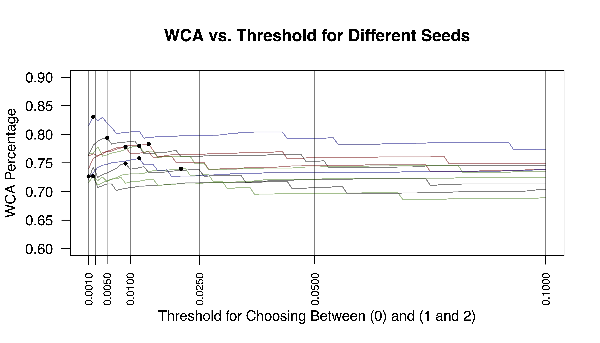

```{r setup, include=FALSE}
library(tidyverse)
library(knitr)
setwd("/Users/andyshen/Desktop/Git/Stats-101C-F20/Midterm Project")
knitr::opts_chunk$set(echo = FALSE)
train <- read.csv("training.csv")
tbl <- 0
fig <- 0
```

## Introduction and Setup

The purpose of this analysis is to identify certain genes that play a role in cancer. We apply statistical learning techniques to a data set of genes and a large number of mutation-related, genomic, phenotype, and epigenetic features; with the goal of identifying oncogenes (OGs), tumor suppressor genes (TSGs), and neutral genes (NGs), ultimately aiding future research into cancer prevention, diagnosis, and treatment.

After plotting each predictor against its respective gene class, we noticed that there existed outliers for many predictor variables in the data set. Most plots saw clusters of points in certain locations without much variability, but there was always at least one stray point in many of the plots that stood out and did not fit the general trend of the plot. We decided to remove the top 50 observations containing the greatest number of outliers, as well as extreme points that clearly stood out as unusual when examining the scatterplots for each predictor. We also remove all rows with more than 50 predictors recorded as 0 in case these metrics might correspond to genes that are irrelevant to the predictions of this analysis. This will hopefully reduce variability and allow predictions to be more accurate. 

Because there were no unknown (`NA`) values in the data set, we did not remove any observations on the basis of missing values. While a vast majority of the predictors were statistically significant, we still had a large number of predictors since the data set had over 90. To further refine our predictors to the most important ones, we visualized the correlation amongst our subset of predictors to see which variables exhibited high correlation. After refining our predictors to those that were both highly significant and largely uncorrelated were we able to begin fitting our models.

## Evaluation Metrics

In terms of evaluating our model, we selected a model using the Linear Discriminant Analysis (LDA) method as well as with Logistic Regression. We prefer this method due to its relatively low flexibility compared to its quadratic counterpart, as well as its reasonable, but not exorbitantly high, test prediction rate. For all techniques used, we ran our model numerous times with different seeds and submitted the model which had a weighted categorization accuracy that was closest to around 0.78, in order to avoid submitting an inaccurate or over-fitted model. 

We calculated the performance of our model using the weighted categorization accuracy (WCA). This score places extra emphasis on correctly identifying oncogenes and tumor suppressor genes, genes that play the largest role in detecting cancer. Less weight is placed on the neutral genes, since their relevance in cancer research was not high.

The distribution of the response variable in the training set is shown in Table `r tbl <- tbl + 1; tbl`.

```{r}
class_dist_train <- data.frame(
  "NG" = paste0(round(mean(train$class == 0) * 100, 2),"%"),
  "OG" = paste0(round(mean(train$class == 1) * 100, 2),"%"),
  "TSG" = paste0(round(mean(train$class == 2) * 100, 2),"%")
)
caption <- paste("Percentage of Gene Type in Training Set.")
class_dist_train %>% kable(digits = 3, caption = caption)
```


After testing various thresholds, predictor combinations, and training/test data sets, LDA proved to be the most consistent when it came to the weighted test error rate. Other techniques, such as Quadratic Discriminant Analysis (QDA) and K-Nearest Neighbors (KNN), saw test error rates that fluctuated when the training and test data were changed. We use 5-fold cross-validation to validate each of our models. Moreover, the sporadically low test error rates seen in QDA and KNN indicate overfitting of the data, while the sporadically high test error rates indicate a poor model fit. Both the consistency of the the LDA technique and the inconsistency of the more flexible techniques led us to conclude that the relationship of the data is likely a linear one. 

The predictors for our first candidate model (model 13) were selected by examining a correlation heat map and fitting a logistic regression model with all predictors. Based on the predictors that were largely uncorrelated from the heat map, we examine all of the significant predictors from the logistic regression model and extract the top 29 predictors that were both significant and had low correlations with other predictors. For instance, many of the predictors beginning with `Broad_` were statistically significant, but were very closely correlated with other predictors of the same `Broad_` family. This led us to only select the most significant predictor from this family that had the least correlation with other predictors of the data set. 

There were many predictors in this data set that were of the same family and closely correlated as well, so we repeated this methodology for all of the significant predictors of the same family. In this analysis, our significance level $\alpha$ was 0.05 divided by the number of predictors in the data set. We scale $\alpha$ because we want to decrease the likelihood of a false positive that could result from running the model multiple times across many different seeds.

To select a threshold, we calculated the weighted categorization accuracy using 5-fold cross-validation across arbitrarily set seeds and selected the model with the WCA closest to 0.80. The threshold with the most consistent performance across all seeds centers from 0.005 to 0.025. 

Our candidate model's WCA for the training data was `r round(0.8100, 3)`, which resulted in a WCA of `r round(0.85248, 3)` on the public leaderboard. 


**Describe model 2 as a variant of the first model**  

Predictor selection for our second candidate model (model 12 revised) was done similarly to our first model; we investigated the correlation between predictors and selectively pared them down before fitting a logistic regression model to identify significant predictors. The key difference being the chosen significance level $\alpha$, as we opted for a slightly less strict threshold of 0.05/6. **I think this was just an arbitrary significance level. Should I say that? Also, does "0.05/6" look better than "0.0083" or "approximately "0.008"?** As such, our second model had 4 more predictors than the 29 in our first candidate model. 

As a result of the different predictors, our weighted categorization accuracy calculations during 5-fold cross-validation revealed that our second candidate model performed most accurately and consistently with a threshold for classifing a given observation as a neutral gene versus an oncogene or tumor suppressor gene was approxmately 0.01.

Our second candidate model's WCA for the training data was `r round(0.8126137, 3)`, which resulted in a WCA of `r round(0.81130, 3)` on the public leaderboard.   

**0.8126137 is just what I got on my computer when I ran it-- If you got something different and would like to change it, go ahead!**

The reasoning for selecting LDA as our two model selections is clear, however we believe our LDA model's threshold explains its strong performance: by lowering our threshold to a value no higher than 2.5%, we account for the uneven distribution and scoring of predicting different responses while simultaneously placing greater emphasis on the less likely responses (OGs and TSGs). This allows us to predict the less-frequent responses at more appropriate intervals, ultimately accounting for the WCA scoring.

### Measuring Error

Figure 1 below shows how the WCA varies with increasing threshold for both candidate LDA models. This measurement greatly aided our selection of a candidate model.

```{r, out.width='100%'}

```
